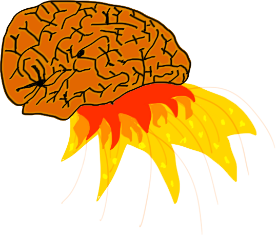

# brainfuck-php

Brainfuck is a turing complete language with 8 instructions.

## Example

Hello World:

    >+++++++++[<++++++++>-]<.>+++++++[<++++>-]<+.+++++++..+++.>>>++++++++[<++++>-]
    <.>>>++++++++++[<+++++++++>-]<---.<<<<.+++.------.--------.>>+.

Cat:

    ,[.,]

## Usage

Just pass a filename to the interpreter:

    $ bin/brainfuck examples/hello.b

You can also pass the --debug option to get a log of all instructions.

    $ bin/brainfuck --debug examples/hello.b

## References

* [Brian Raiter's guide](http://www.muppetlabs.com/~breadbox/bf/)
* [Daniel B. Cristofani's examples](http://www.hevanet.com/cristofd/brainfuck/)
* [Brainfuck on Esolang](http://esolangs.org/wiki/Brainfuck)
